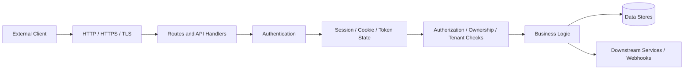
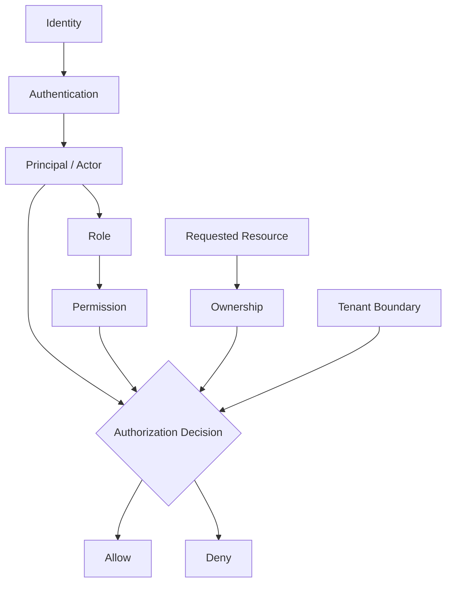
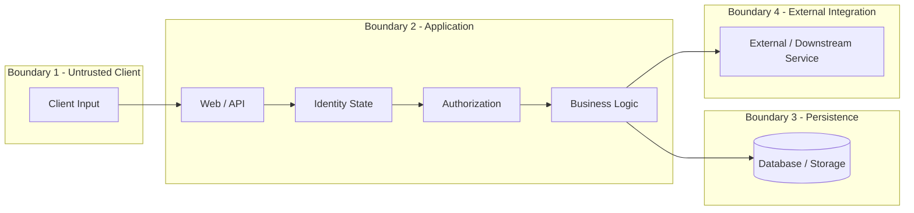

# Phase 3 Foundations - Architecture and Trust-Boundary Diagrams
## Provenance
- Branch: `security/phase-3-foundations`
- Source HEAD: `2e7a5ef92090aa6997f1841d4dba440618cbf306`
- Basis: Phase 3 static source mapping and evidence
- Runtime status: **UNVERIFIED**
## Request and security-control flow

### Security interpretation
Each transition can become a trust decision. Runtime verification must
determine which transitions actually exist and whether the expected
controls execute before sensitive actions.
## Identity and authorization model

## Trust-boundary model

## Evidence limitations
These diagrams are security-analysis models derived from static
candidates. They are not assertions of confirmed runtime architecture.
Action 3.14 must verify representative paths using the authorized local
lab before runtime conclusions are made.
